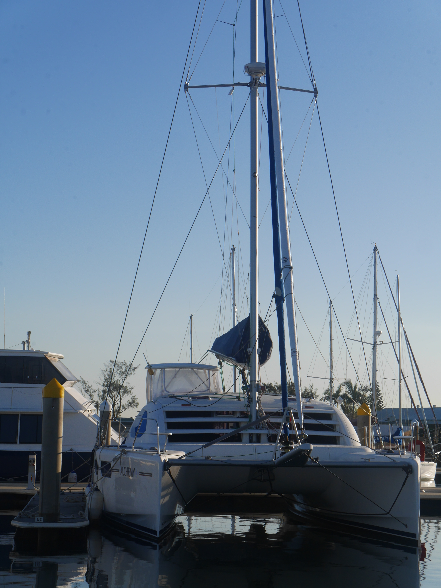

# Alchemy

## Disclaimer

The information contained are owners notes and accomanying material regarding a Leopard 46 yacht.

This material has been made available for historical reasons only.

The notes were made about a specific boat in the owners specific circumstances. Every boat is different, and every situation unique. In no circumstances should this information be considered complete or accurate.

Please review the licence file should you wish to make a copy any of this information.

# Alchemy 1

# Specifications

**Leopard 46 – 2007 Alchemy 1**

**Boat Details**

**Make** Leopard

**Builder** Robertson &amp; Caine International Yachts, South Africa

**Designer** Morelli &amp; Melvin, USA

**Model** 46 – 4 Cabin Version

**Year** 2007

**Type** Sail

**Class** Catamaran

**Length** 14.13 m

**Width** 7.57 m

**Draft** 1.25 m Lightship

**Displacement (Lightship)** 10,980 kg

**Load Carrying Capacity** 6,020 kg

**Mast Height above DWL** 21.57 m

**Hull Material** Fibreglass (Composite GRP with end grain balsa core sandwich)

Foam filled GRP sacrificial keels ( Bolted to main hull and easily removed if damaged)

**Hull No** ZA-RACA 1026F707

**Australian Reg No** 860459

**Port of Registration** Southport

**Location** Queensland, Australia

**Propulsion** Yanmar 4JH5E Diesels

**Propellors** 18&quot;x 3 blade stainless Sea Hawk Slipstream folding propellers

**Power** 53 HP

**Engine Hours** 195 Hours Starboard (new 2019)

100 Hours Port (new 2020)

**Drive Type** Yanmar SD60 Saildrives (new 2019)

**Rudders** Balanced foam filled fibreglass spade rudders with JP3 bearings. New bronze bearing housing fitted in 2016 with new plastic bearing balls.

**Generator** Yanmar 3TNV76-GMA 9 kVa Diesel - 1426 Hours located in soundproof insulated box in Port forward locker

**Sail Areas** Mainsail 88.5 m2 Evolution Sails Polyant Pro-Radial with 2 Reefs (new 2016)

Furling Genoa 59 m2 (new 2015) with new Profurl C480 furler (new 2016)

Furling Screacher 122 m2 Evolution Sails Polyant Px10i Optical sail with Profurl furler (new 2016)

**Winches** Helm 2 x Lewmar 54 self-tailing 2 speed winches, Anderson 28ST self –tailing winch for furling genoa

2 x Lewmar 46 halyard winches on mast (Note : The Lofrans 1500W electric windlass with footswitch is used to raise the mainsail and furl the screacher)

2 x Lewmar 14 single speed winches on dinghy davits

Milwaulkee Right Angle M28 Battery Drill with winch attachment is used at helm for sheeting the main and genoa and aft for raising the dinghy.

**Fresh Water Capacity** 900 Ltr ( 2 x 450 Ltr plastic tanks)

**Water Maker** 40 gallon per hour

**Fuel Capacity** Diesel 700 Ltr ( 2 x 350 Ltr aluminium tanks with baffles and inspection ports on top for tank cleaning if required) plus 5 x 20 Ltr plastic fuel containers

**Electrical System** DC - 12 V, AC – 110 V / 60hz , 240V / 50 hz

USB charging points in saloon, chart table, aft cabins and at helm station

Xantrex 1000W inverter, RVTransformer 240/110- 50/60Hz

Enerdrive eLite battery monitor located at chart table indicates charging rate and amount of charge in the house battery bank

The majority of the lighting both internal and external is achieved with low energy LED lights.

**Starter Battery (each**) MF95D31R Supercharge Maintenance Free Lead Acid 95 Ah (new 2017)

**House\*\*** Batteries\*\* 5 x GPL4DL Longlife AGM batteries 210 Ah each, Total 1050 Ah (new 11/16)

**Solar** 4 x 250 Ah Kyocera panels (new Oct 2012) With sunny clear weather the solar panels will fully charge the battery bank during the day. The house battery bank normally reduces to 70% overnight running the fridges and freezers when on anchor. When overcast topping up using the generator is required.

**Charger** Blue Sky Charge Controllers 3024 iL + Monitor at chart table (new Oct 2012)

Victron 40 Amp battery charger

The new Yanmar 4JH5E motors both have 12V-125A alternators that charge both the engine battery and the house batteries when motoring.

**Gas Locker** Large aft cockpit self draining ventilated gas storage locker. Stores up to 3 x 40 kg gas bottles. Gas compliant Plate Queensland Government. An electric solenoid cut off valve attached to pressure gauge and regulators is located in the storage compartment and a warning light above galley sink when gas is turned on. Gas switch is located on the main switchboard.

**Airconditioners** Cruisair – Saloon 16,000 BTU, Starboard 16,000 BTU (new 2016)

**Washing Machine** LG toploader

**Anchor Winch** Lofrans Tigress 1500W winch (new 2016)

Winch doubles as electric windlass to raise mainsail and furl screacher

Jabsco deck wash salt water pump and hose with nozzle (new 2016)

**Anchors** Rocna 33 kg main anchor with spare 45 kg plough, 300&#39; 10mm chain

New heavy duty bridle fitted 2016

**Rigging** Mast / Boom by Sparcraft Cape Town 2007

New upper and lower stainless wire stays by David Lambourne Riggers Brisbane including strengthening and lowering of boom with custom aluminium tube boom bag widening. (new 2016 uppers, new 2019 lowers)

Custom built fibreglass folding bowsprit by David Lambourne Rigging (all rigging and bowsprit work new 2016) Bowsprit has non-skid top surface acting as a walkway to gain access to the snap shackles to release the whiskers when in a marina when it is necessary to raise the bowsprit into the vertical position. The bowsprit adds 6&#39; to the length of the boat making it 52&#39; long with it in the down position.

**Tender** Caribe 12&#39; RIB with fibreglass double hull. A very strong seaworthy dinghy. With 2 people it can easily plane and achieve high speeds.

Yamaha 15HP 2 stroke outboard, 2 Ltr fuel tank, Anchor locker, Fortress anchor. Protective canvas chaps fitted to top of inflatable pontoons (new 2016)

Fitted with Beachmaster wheels for easy haul out on beaches (new 2016)

**Life raft** OceanSafe 6 Man liferaft (new 2016) fitted with EPIRB and mounted under rear cockpit seat for quick release

**Safety Gear** 2 x Viking auto inflating life jackets fitted with MOB1 AIS transponders with auto activation on inflation of life jacket. Location shown on Chart plotter up to 5 km from yacht. Jackets fitted with Lifting Strap and shackle with tethers. (new 2016)

4 x Marlin manual inflating lifejackets (new 2016), 6 x harnesses and tethers

3 x Children&#39;s Life Jackets

4 x strap webbing lifelines which are attached to deck for safe movement on deck in heavy weather. Crew attach tethers to lifejacket and lifeline when moving on deck in rough seas

1 x Burke Bosuns Chair for access to mast fittings (new 2016)

ABE fire extinguishers located throughout the boat. Aft cabins 2 x 2.5 kg ABE powder. Saloon 2 x 1 kg ABE powder. Forward cabins 2 x 1 kg ABE powder. All on wall mounted quick release brackets. Additional 2 x Fire blankets in galley.

**Sea Anchor** Burke Sea Brake Drogue with dedicated bridle and rope lines stowed in aft cockpit locker. (new 2017)

**Fenders** 1 x very large 400 diam white fender,4 x large white 300 diam fenders , 6 x medium 200 diam blue cloth covered fenders, Large ball fender 450 diam x 500 high. 4 x black rope docking lines with loop ends including 4 x heavy duty white rope lines. Large fenders stored in forward storage compartment accessed via 600x600 Lewmar hatch. Smaller fenders stored in forward Genset / Battery compartment locker.

**HWS** 2 xForce 10 x 23 Ltr hot water tanks under aft bunks Port and Starboard. Water is heated via main engines or genset or shorepower.

Hot/Cold showers in all cabins and flexible shower hose on aft Port near swimming ladder. All mixer taps throughout boat including the galley sink.

**Fridge / Freezers** Seafrost upright heavy duty stainless cabinet 12V separate fridge and freezer are located below the switchboard in the saloon. These units have freezer plates. Additional Evacool Fridge/Freezer is located under the pilot station seat and another one under the forward starboard bunk used as a backup freezer for long passages.

**Greywater Tanks** Greywater from the 4 Jabso Quite Flush electric toilets can be diverted to plastic (new 2016) holding tanks located behind the shower wall on each side of the boat. These can be discharged when out at sea or at a shore pump out station. Most of the toilets have had new macerators and salt water flushing pump upgrades and new seating in the past 5 years.

**Entertainment** Fusion Bluetooth Radio / CD player with 4 x Bose wall mounted speakers in saloon and aft cockpit

Teac 32&quot; wall mounted TV in saloon ( HDMI and USB connectors) Antenna mounted on mast crosstrees

Teac 24&quot; wall mounted TV in Port Aft Cabin

# Owners comments

Alchemy 1 was launched in Cape Town in 2007 and her first owners put her into crewed charter in Key West, Florida for her first 5 years. Despite being in charter the condition of the woodwork, Corian benchtops and equipment are in very good condition. Maintenance by the subsequent owners has ensured the boat is in very good condition and has the appearance of a well loved and cared for boat.

She was then purchased in USA by an Australian couple who cruised the Caribbean and sailed her across the Pacific to Australia and on arrival paid all the import duties/taxes and registered her as an Australian ship. After selling the boat they then purchased a Leopard 48 in USA.

The current owners purchased her in Australia in Jan 2016 and carried out extensive upgrades with a $200,000+ refit including new sails, rigging, motors/saildrives, electronics and much more.

The current owners have cruised over 25,000 miles in the South Pacific including NZ, Tonga, Fiji, Vanuatu, New Caledonia and East Coast Australia.

The skipper is a Professional Engineer and has had over 50 years sailing experience having built a yacht and sailed it around the Pacific including New Guinea and Solomon Islands in the 80&#39;s.

The search for the perfect catamaran for long distance cruising adventures was one that was based on previous sailing experience both on catamarans and monohulls. The choice of available designs is extensive and the owners understood the need to balance a fast lightweight low load carrying capacity racing catamaran with a slower higher load carrying capacity model.

The choice of length is very important if you are planning on ocean voyages. It is also a compromise and too short makes for uncomfortable sailing in rough swells and too long equates to the need for crew and more cost in the purchase price. The most popular length for short handed cruising is 45&#39;.

A catamaran with good sailing performance but also good for cruising was the Leopard 46 with its spacious interior with a dining table to seat 8 , aft cockpit with a table to seat 10 and a brilliantly designed helm station that seats up to 3. Access to the helm is via a stainless ladder in the cockpit.(New 2016). The helm station provides a protected position with single handed operation of the genoa and mainsail sheets and mainsail traveller. For long distance sailing or in rough windy wet conditions this helm station is very much a necessity not just a luxury. Steering out in the open is OK in good weather for day sailing but not an option for long distance. The design of this elevated helm station is one of the many reasons for choosing a Leopard 46.

The accommodation with 2 x queen size beds in the aft cabins and 2 x double beds forward along with a kids bunk forward of the Port cabin also meet with our requirement to occasionally entertain family and guests. All cabins have adequate storage lockers including hanging lockers. They also provide high quality solid doors for privacy and separate spacious heads with corian washbasin with mixer tap and mirrored vanity unit with large separate shower stall with doors. All marine toilets are oversized and all electric.

With the addition of the 6&#39; long fibreglass folding bowsprit and a 122 m2 screacher you have the ability to achieve relatively fast passage making with a fully loaded boat (6000 kg max includes full fuel and water tanks). The screacher is furled once the apparent wind reaches 20 knots. A speed of 12 to 14 knots on a beam reach and 20 knots apparent wind can be achieved with a fully loaded boat. You also need to consider having sufficient propulsion and this is achieved with the Yanmar 54HP diesel motors that propel the boat along at 7.5 knots (single motor 2000 rpm) or if you need to make your anchorage before dark or a storm you can run both motors and achieve up to 9 knots at 2500 rpm.

The owners spend a lot of time in the aft cockpit area which with the addition of well designed and strong awnings it makes this area an extension of the saloon. The awnings have windows that can be rolled up depending on the temperature and in cooler parts of the world or winter in Queensland they make for a very cosy warm area to relax and entertain.

The helm or pilot station is also fitted with protective roll up clears for forward viewing and the sides and rear awnings are made with a mix of roll up clears and Sunbrella type fabric to protect the crew from the sun and rain.

The owners have custom fitted hard wearing and easy cleaning external carpet in the aft cockpit (faux teak pattern) which makes for a soft cool surface to walk on. The Leopard 46 was the last model fitted with high quality stainless steel framed doors and windows between the saloon and aft cockpit.

The Leopard 46 design and build is very strong and evidence of this is the fact that most of these boats were sailed around the world by professional crews to deliver them to new owners. Approximately 200 of this model were built before the end of production in 2012.

The current owners as a couple have no problem sailing long distance without crew. They have also found when having guests on board that the private 4 cabin layout with individual bathrooms all with Jabso large electric Quite Flush toilets makes entertaining up to 6 people easy work and enjoyable both for the owners and the guests.

All cabins are fitted with large 600x600 overhead hatches and fans. The aft cabins have additional rear opening small port window and all cabins have large fixed windows just above water line. The windows are all fitted with fabic sun block blinds on a sliding track. The overhead hatches have fly screens and sun block screens. All cabins and saloon are air conditioned but with the design of the hatches providing good cross flow ventilation it is rare that the air conditioning is required except in the tropics in summer. Not a good place to be in the cyclone season.

The rear awnings and all the hatches in the salon and cabins and bathrooms have insect screens and sunshades.

If you are looking for a catamaran for cruising the Australian Coast or the Pacific or further away it is hard to go past a Leopard 46 and one that has had extensive upgrades making for an enjoyable experience similar to owning a new boat. Alchemy 1 has a fastidious owner who has refitted it so that it is ready to go anywhere in the world without the need for paying for upgrades.

**Navigation Gear** Raymarine Chart Plotters – a125 touchscreen at the chart table along with a c97 at the helm station both linked with a Raymarine Sea-Talk converter.

Raymarine ST6002 Autopilot controllers at chart table and helm station with SmartPilot computer and Drive Unit under galley sink, Fluxgate compass above sink behind the wall cover and Rudder Position Sensor attached to Starboard Rudder Arm in aft engine compartment. A spare electric Drive Unit is located in spares stores under Port forward bunk.

Raymarine ST60+ Wind Gauge

Raymarine Tridate Depth Sounder (Transponders on both hulls with Port side depth and water temp shown on chartplotter

Raymarine 48 NM Radar

Sitek AIS Transponder Class B

Raymarine VHF Radio

Linden handheld floating VHF portable radio ( 5 mile range)

Icom IC-M801E SSB Radio with Tuner, Ground Plate and Whip Antenna

Iridium Go Satellite Modem and Antenna (mounted on cockpit coach roof)

2 x Raymarine cameras mounted on crosstrees allow clear view on the helm station chartplotter of the dock when reversing into a marina pen

**Galley/ Saloon**

The Leopard 46 galley up design incorporates a spacious saloon area in a cherry wood finish with a wide U shaped settee and an aft facing galley with plenty of room to circulate. A softly curved Corian cocktail bar overlooks the adjoining cockpit area, enabling drinks to be served directly to the cockpit.

The U shaped galley incorporates Corian bench tops, double deep stainless sinks with mixer tap and overhead cabinets. The cupboards below bench level easily store cooking gear, plates and incorporate sliding drawers for the cutlery and other kitchen items. Catering is no problem with the large fridge and freezer system to Port with well insulated compartments with wire shelving and stylish stainless steel doors. Evacool 12V Fridge/Freezer under helm seat for storage of vegetables. An additional 12V portable fridge /Freezer is located under the starboard forward bunk and used for long distance passages or when accommodating guests when you need more fridge storage space.

Dining tableseats 8 comfortably. Saloon suede seats new 2017.

Force 10 with 3 burner cooktop and oven with grill burner

Microwave oven

All kitchen items including kettles, toasters, cutlery, crockery, saucepans, coffee maker, etc including white and red wine plastic glasses and water drinking glasses are included.

Large plastic cool box storage box with padded lid seat under dining table

**BBQ** Marine stainless steel gas Sovereign BBQ with lid and grill / hot plate combination. Mounted on aft rail near dinghy davit. Overhead lights illuminate rear scoop steps and BBQ and Fish cutting board also mounted on aft rail on Port side.

**Manuals** Leopard 46 Owners Manual , Yanmar Diesel Motor manuals , Yamaha outboard manual, SSB Radio manual Blue Sky Solar Controller manual, etc
